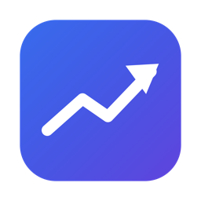
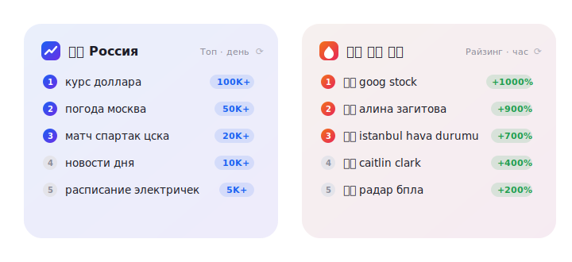

<div align="center">



# Trends

**Поисковые тренды Google — прямо на рабочем столе macOS**

Настраиваемые страны · Топ и Райзинг · Час / день / неделя · Единая таблица




</div>

---

## ✨ Возможности

|  | Что умеет |
|---|---|
| 🌍 | **30 стран на выбор** — добавляйте любые через «Редактировать виджет»; результаты сводятся в единую таблицу с флагами |
| 📊 | **Два раздела** — «Топ» (по объёму поиска) и «Райзинг» (по % роста популярности) |
| ⏱ | **Три окна времени** — час, день, неделя |
| 🔄 | **Свой интервал обновления** — 15 / 30 / 60 минут + кнопка ⟳ в самом виджете |
| 📐 | **Три размера** — small (топ-3), medium (топ-4), large (топ-9) |
| 📴 | **Офлайн-кэш** — при пропаже сети виджет показывает последние данные с пометкой времени |
| 🖱 | **Клик по тренду** — открывает его страницу в Google Trends |
| 🌐 | **Два языка интерфейса** — английский (по умолчанию) и русский; названия стран — на языке системы |
| 🔒 | **Приватность** — App Sandbox, только HTTPS, ноль сторонних зависимостей, никакой телеметрии |

Можно держать несколько виджетов одновременно — например, «🇷🇺 Топ · день»
рядом с «🇷🇺 🇺🇸 🇹🇷 Райзинг · час».

## 🚀 Установка

Приложение устанавливается сборкой из исходников. Это принципиально:
сборка должна быть подписана **вашим** Apple ID — без Team ID в подписи
macOS не применяет настройки виджета (подробности в «Известных
ограничениях»). Платная подписка Apple Developer не нужна.

### Что понадобится

- macOS 14+
- Полный **Xcode 16+** (из App Store; Command Line Tools недостаточно)
- Apple ID, добавленный в Xcode: **Xcode → Settings → Accounts → «+»** —
  при входе автоматически создаётся бесплатная Personal Team
- [XcodeGen](https://github.com/yonaskolb/XcodeGen): `brew install xcodegen`

### Шаги

1. Узнайте свой Team ID: **Xcode → Settings → Accounts** → выберите свой
   Apple ID — рядом с Personal Team показан идентификатор вида `AB12CD34EF`
2. Создайте в корне репозитория файл `project.local.yml` (он в
   `.gitignore` — ваш Team ID не попадёт в git):

```yaml
settings:
  base:
    DEVELOPMENT_TEAM: AB12CD34EF   # ваш Team ID
```

3. Соберите и установите:

```bash
git clone <repo-url> && cd widget-trends
make install
```

`make install` соберёт Release и положит приложение в `/Applications`.
При первой сборке Xcode сам выпустит сертификат Apple Development —
разрешите доступ к связке ключей, если macOS спросит. Затем запустите
приложение один раз — виджет появится в галерее.

### Добавление виджета

Клик по **дате в строке меню** → **«Изменить виджеты»** → найдите
**Trends** → перетащите на рабочий стол. Страны, период, раздел и
интервал — правый клик по виджету → **«Редактировать „Trends“»**.

## 🛠 Команды разработки

| Команда | Действие |
|---|---|
| `make test` | Юнит-тесты TrendsKit (23 теста, без Xcode-проекта) |
| `make build` | Release-сборка (universal: arm64 + x86_64) |
| `make install` | Сборка + установка в /Applications + перепривязка виджетов |
| `make lint` | SwiftLint в строгом режиме |
| `make clean` | Удалить всё сгенерированное |

## 🏗 Как устроено

```
TrendsKit (Swift-пакет)          Widget (WidgetKit)        App (контейнер)
┌─────────────────────────┐      ┌────────────────────┐    ┌────────────────┐
│ TrendingAPIClient ──┐   │      │ ConfigurationIntent│    │ Дропдауны:     │
│ GoogleTrendsClient ─┤   │      │  страны·период·    │    │  страны/раздел/│
│  (RSS-фолбэк)       │   │      │  раздел·интервал   │    │  период        │
│                     ▼   │      │         │          │    │       │        │
│ Parsers → Aggregator ───┼──────┼─▶ TimelineProvider │    │       ▼        │
│                     │   │      │   кэш→сеть(5с)→кэш │    │ Единая таблица │
│ TrendsCache ◀───────┘   │      │         │          │    │ (№·страна·     │
│ TrendsService (фасад)   │      │         ▼          │    │  запрос·объём· │
└─────────────────────────┘      │   TrendsWidgetView │    │  рост)         │
                                 └────────────────────┘    └────────────────┘
```

- **Источник данных** — внутренний API Google Trends «Trending Now»
  (batchexecute): объём поиска, % роста, окна 1 ч – 7 дней. При его
  недоступности — автоматический фолбэк на официальный RSS-фид.
- **Мультистрановость** — параллельная загрузка всех выбранных стран,
  дедупликация одинаковых запросов (побеждает максимальный объём),
  единая сортировка.
- **Устойчивость** — трёхступенчатая деградация: свежий кэш → сеть с
  таймаутом 5 с → любой кэш с пометкой → пустое состояние с ретраем.

Полный разбор цепочки вызовов по каждому файлу и обоснование алгоритмов —
в **[docs/ARCHITECTURE.md](docs/ARCHITECTURE.md)**.
Бизнес-требования и история решений — [docs/BRD.md](docs/BRD.md),
декомпозиция работ — [docs/DECOMPOSITION.md](docs/DECOMPOSITION.md).

## ⚙️ CI

[`ci.yml`](.github/workflows/ci.yml) на push / PR в `main` гоняет
юнит-тесты TrendsKit и SwiftLint (строго). Сборки приложения в CI нет:
на раннере нет сертификата команды, а ad-hoc сборка бессмысленна —
у неё не работает конфигурация виджета (см. «Известные ограничения»).

## 🔒 Безопасность

- App Sandbox включён; единственная привилегия — исходящая сеть
  (`com.apple.security.network.client`)
- Только HTTPS (App Transport Security по умолчанию)
- Ноль сторонних runtime-зависимостей — нечему утекать
- Нет секретов, ключей и телеметрии; приложение ничего не знает о вас

## ⚠️ Известные ограничения

- Окно «месяц» невозможно: источник отдаёт максимум 7 дней
- «Мир»/несколько стран — агрегация по странам (у Google нет гео «весь мир»)
- API batchexecute неофициальный и может измениться; на этот случай есть
  RSS-фолбэк и изолированный парсер
- После обновления приложения размещённый виджет может потребовать
  пересоздания (или `killall chronod`) — `make install` делает это сам
- Сборка без Team ID (ad-hoc, `CODE_SIGN_IDENTITY=-`) выглядит рабочей,
  но меню «Редактировать виджет» молча не применяет настройки: AppIntents
  резолвит параметры конфигурации через системный `linkd`, которому нужен
  Team ID подписи. Поэтому установка — только сборкой из исходников со
  своим Apple ID; готовые DMG не распространяются

---

<div align="center"><sub>Сделано на Swift · SwiftUI · WidgetKit · без единой сторонней зависимости</sub></div>
