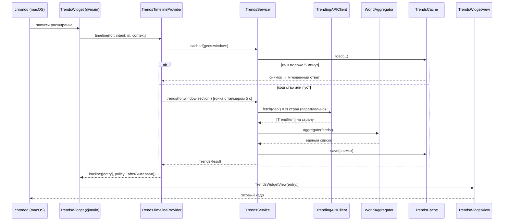

# Архитектура Trends: полный проход по цепочке вызовов

Документ проходит все файлы проекта в порядке реального потока данных —
от системного запроса «отрисуй виджет» до пикселей на экране — и объясняет,
**что** вызывается, **откуда**, **куда** ведёт дальше и **почему** выбран
именно такой алгоритм.

## Карта проекта

```
project.yml                  ← манифест XcodeGen: 2 таргета + пакет
├── TrendsKit/               ← Swift-пакет: вся логика данных (без UI)
│   └── Sources/TrendsKit/
│       ├── TrendsCountry.swift        модель страны (флаг, имя, список)
│       ├── TrendsOptions.swift        окно времени + раздел
│       ├── TrendItem.swift            модель тренда + числовые алгоритмы
│       ├── TrendingAPIClient.swift    HTTP-клиент batchexecute (основной)
│       ├── TrendingAPIParser.swift    парсер ответа batchexecute
│       ├── GoogleTrendsClient.swift   HTTP-клиент RSS (фолбэк)
│       ├── TrendsFeedParser.swift     парсер RSS (XMLParser)
│       ├── WorldAggregator.swift      сведение стран в одну таблицу
│       ├── TrendsCache.swift          снимки в UserDefaults
│       └── TrendsService.swift        ФАСАД: единственная точка входа UI
├── Widget/                  ← WidgetKit-расширение (отдельный процесс!)
│   ├── TrendsWidget.swift             @main, регистрация виджета
│   ├── RegionOption.swift             AppEnum-параметры конфигурации
│   ├── CountryEntity.swift            AppEntity: мультивыбор стран
│   ├── RefreshTrendsIntent.swift      интерактивная кнопка ⟳
│   ├── TrendsTimelineProvider.swift   мозг виджета: когда и что показывать
│   └── TrendsWidgetView.swift         SwiftUI-отрисовка
└── App/                     ← приложение-контейнер
    ├── TrendsApp.swift                @main приложения
    └── ContentView.swift              дропдауны + единая таблица
```

Ключевой факт для понимания всего дальнейшего: **приложение и виджет —
два разных процесса**. Виджет живёт внутри системного демона виджетов
(chronod), приложение — само по себе. Общий у них только код `TrendsKit`
(каждый процесс держит свою копию) и косвенная связь через
`WidgetCenter.reloadAllTimelines()`.

---

## Цепочка 1: система просит виджет обновиться

Это главный сценарий. Инициатор — chronod: по расписанию таймлайна,
после «Редактировать виджет», после клика ⟳ или после
`reloadAllTimelines()` из приложения.



### Шаг 1.1 — вход: `Widget/TrendsWidget.swift`

`TrendsWidgetBundle` помечен `@main` — это точка входа процесса
расширения. Внутри `TrendsWidget.body` собирается
`AppIntentConfiguration(kind:intent:provider:content:)`, связывающая
три вещи: интент конфигурации (что настраивает пользователь), провайдер
(откуда данные) и вью (как рисовать). `supportedFamilies` объявляет
три размера — от этого зависит, какие варианты предложит галерея.

### Шаг 1.2 — конфигурация: `RegionOption.swift` + `CountryEntity.swift`

Когда пользователь открывает «Редактировать виджет», macOS **не**
спрашивает наш код про enum-параметры (`WindowOption`, `SectionOption`,
`RefreshOption` — их варианты статичны, зашиты в
`caseDisplayRepresentations`). А вот для параметра-массива
`countries: [CountryEntity]?` система вызывает `CountryEntityQuery`:

- `suggestedEntities()` — список для UI «добавить страну» (30 стран из
  `TrendsCountry.supported`);
- `defaultResult()` — что показывать, пока пользователь ничего не выбрал
  (Россия);
- `entities(for:)` — восстановление сохранённого выбора по массиву id
  (id = ISO-код, поэтому восстановление — тривиальный map).

**Почему AppEntity, а не AppEnum:** массив-параметр с AppEnum в
конфигураторе виджета не даёт UI «добавить из списка»; AppEntity с
EntityQuery — штатный механизм мультивыбора (так работает выбор альбомов
в виджете Фото).

**Почему id — ISO-код, а не индекс:** конфигурация сериализуется системой
и должна переживать обновления приложения; коды стабильны, индексы — нет.

Защита от пустого выбора живёт в `RegionConfigurationIntent.selectedCountries`:
пустой массив → `[.fallback]` (Россия), чтобы виджет никогда не оказался
без гео.

### Шаг 1.3 — мозг: `TrendsTimelineProvider.swift`

chronod вызывает один из трёх методов:

- `placeholder(in:)` — синхронный, для «скелета» в галерее. Возвращает
  статичный `TrendsEntry.placeholder()` — сети здесь быть не должно,
  система ждёт мгновенного ответа.
- `snapshot(for:in:)` — превью. Если `context.isPreview` — тот же
  плейсхолдер (галерея не должна ждать сеть), иначе — реальные данные.
- `timeline(for:in:)` — боевой путь. Всегда возвращает **один** entry
  и политику `.after(интервал)`.

Алгоритм `makeEntry` — трёхступенчатая лестница деградации:

```
1. Кэш моложе 5 минут?      → показать мгновенно (сети нет вообще)
2. Сеть в пределах 5 секунд? → показать свежие данные
3. Любой кэш?                → показать с пометкой «данные от HH:mm»
4. Ничего?                   → пустое состояние + ретрай через 60 с
```

**Почему ступень 1 (cache-first):** при смене настроек виджета chronod
запрашивает новый таймлайн, но до его готовности показывает старый кадр.
Если для нового сочетания (страны, окно) уже есть свежий кэш — отвечаем
за миллисекунды, и «переключение региона» ощущается мгновенным.

**Почему ступень 2 — гонка задач, а не обычный await:** сетевой запрос
на 8 стран в плохой сети может висеть десятки секунд, и всё это время
виджет показывал бы устаревший кадр. `withTaskGroup` запускает две
задачи — реальный запрос и `Task.sleep(5 с)` — и берёт **первый**
результат (`group.next()`), после чего `cancelAll()` отменяет проигравшую
(URLSession отменяем). Это классический паттерн «timeout race»: либо
данные за 5 с, либо переходим к кэшу, а сеть догонит на следующем цикле.

**Почему интервалы в `timeline` разные:** пусто → 60 с (авария, пробуем
чаще); из кэша → min(интервал, 5 мин) (надо дотянуться до сети раньше
обычного); свежие данные → интервал пользователя. WidgetKit имеет бюджет
обновлений, поэтому бесконтрольно частые ретраи недопустимы — 60 с
только для пустого состояния, которое иначе бесполезно.

### Шаг 1.4 — фасад данных: `TrendsService.swift`

Единственная точка входа для обоих UI. Публичный контракт:

- `cached(geos:window:)` — прямой проброс в кэш (нужен провайдеру для
  ступени 1);
- `trends(for:window:section:limit:)` — полный цикл: сеть → агрегация →
  кэш → сортировка раздела; при ошибке — кэш с флагом `isFromCache`;
  если нет и кэша — проброс ошибки (UI решает, что рисовать).

Внутри `fetchFresh` два контура:

1. **Основной** — `TrendingAPIClient` по каждой стране;
2. **Аварийный** — при *любой* ошибке основного повторяем то же самое
   через RSS (`GoogleTrendsClient`).

**Почему фолбэк именно целиком, а не по-страново:** частичный успех
(3 страны из 8) дал бы таблицу, в которой «Мир» состоит из трёх стран —
это тихое искажение данных. Честнее: либо полный набор из одного
источника, либо кэш с пометкой.

**Почему RSS вторым, а не первым:** RSS отдаёт только «топ за день»
без процента роста и без окон времени — он покрывает лишь одну из шести
комбинаций (день × топ), остальные показывал бы приблизительно.
batchexecute покрывает всё, поэтому он основной, RSS — страховка от
поломки неофициального API.

Параллелизм — `withThrowingTaskGroup`: N стран запрашиваются
одновременно, итоговое время = самый медленный запрос, а не сумма.
Ошибка любой задачи роняет группу целиком (см. «почему фолбэк целиком»).

Сортировка раздела — `TrendsService.sort(_:by:)`:

- **Топ** — по `trafficValue` по убыванию; при равенстве — по алфавиту
  (детерминированность: одинаковый ввод → одинаковый порядок, иначе
  виджет «мерцал» бы перестановками при каждом обновлении);
- **Райзинг** — по `growthPercent ?? 0` по убыванию, при равенстве — по
  объёму. `nil` (данные из RSS-фолбэка) трактуется как 0 — такие элементы
  честно уходят в конец, а не исчезают.

Хранится в кэше **несортированный** superset на 40 элементов: «Топ» и
«Райзинг» — это две сортировки одних и тех же данных, глупо ходить в
сеть при переключении раздела.

### Шаг 1.5 — HTTP: `TrendingAPIClient.swift`

Формирует POST на `trends.google.com/_/TrendsUi/data/batchexecute` с
телом `f.req=[[["i0OFE","[null,null,\"RU\",0,\"ru\",24,1]",null,"generic"]]]`,
где `24` — окно в часах из `TrendsTimeWindow.hours`.

**Почему тело собирается через JSONSerialization, а не строковой
конкатенацией:** внутренний массив — это *строка JSON внутри JSON*
с двойным экранированием кавычек; ручная сборка таких матрёшек — вечный
источник багов, сериализатор экранирует гарантированно правильно.

**Почему percent-encoding с ручным allowed-set (буквы, цифры, `-._`):**
`application/x-www-form-urlencoded` требует кодировать всё, включая
кавычки и запятые; штатный `.urlQueryAllowed` оставляет слишком много
символов «как есть». Консервативный набор кодирует лишнее, но никогда —
недостаточно.

Таймаут 15 с на запрос — потолок; в виджете его дополнительно
обрезает 5-секундная гонка (см. 1.3), в приложении можно подождать дольше.

### Шаг 1.6 — парсинг: `TrendingAPIParser.swift`

Ответ — не чистый JSON:

```
)]}'

[["wrb.fr","i0OFE","[null,[[тренд],[тренд],...]]", ...], ["di",...], ...]
```

Алгоритм: (1) отрезать анти-JSON-префикс `)]}'` поиском первой `[`;
(2) распарсить внешний массив «конвертов»; (3) найти конверт `wrb.fr`,
у которого третий элемент — строка; (4) распарсить эту строку как JSON
ещё раз; (5) пройти тренды, читая **позиционные** индексы: 0 — запрос,
2 — гео, 3 — [unix-время старта], 6 — объём, 8 — процент роста.

**Почему JSONSerialization + индексы, а не Codable:** формат
недокументирован, поля безымянны (это protobuf-подобный массив), половина
элементов — `null`. Codable-модель под такое либо невозможна, либо
превращается в частокол `unkeyedContainer`-акробатики. Прямые индексы с
защитой `entry.count > i` — короче и переживает добавление новых полей
в хвост массива.

**Почему конверт с ошибкой (`[13]` вместо строки) даёт throw, а пустой
список трендов — `[]`:** это разные ситуации. Ошибка формата должна
запустить RSS-фолбэк в сервисе; пустой (но валидный) ответ — легитимные
«нет трендов», фолбэк не нужен.

### Шаг 1.7 — фолбэк-парсер: `TrendsFeedParser.swift` + `GoogleTrendsClient.swift`

RSS парсится потоковым `XMLParser` (SAX): делегат копит символы текущего
элемента и по `</item>` собирает `TrendItem`.

**Почему SAX, а не DOM/регэкспы:** `XMLParser` — единственный XML-парсер
в Foundation без сторонних зависимостей; SAX не строит дерево (меньше
памяти) и естественно ложится на плоскую структуру RSS. Регэкспы по XML —
антипаттерн (CDATA, экранирование, вложенность).

Тонкость: `shouldProcessNamespaces = false`, поэтому элементы приходят
с префиксами как есть — `ht:approx_traffic`, `ht:news_item_title`.
Сравнение по полному имени страхует от захвата чужого `title` из
вложенного `ht:news_item` (это покрыто тестом
`testNewsItemTitleDoesNotLeakIntoTrendTitle`).

`GoogleTrendsClient.fetch` после парсинга **переупаковывает** элементы,
проставляя `geo` (RSS сам не сообщает страну — а колонке «Страна» в
единой таблице она нужна).

### Шаг 1.8 — числовые алгоритмы: `TrendItem.swift`

- `parseTraffic("1 000+") → 1000` — RSS отдаёт объём строкой в разных
  локалях: обычный пробел, неразрывный (U+00A0), узкий (U+202F), запятые,
  суффиксы K/M. Алгоритм: регэксп вычищает всё «декоративное», затем
  снимается суффикс-множитель. Неизвестный формат → 0, а не ошибка:
  одна кривая строка не должна ронять весь фид (сортировка просто уведёт
  элемент вниз).
- `format(volume: 2_500) → "2.5K+"` — обратная операция для API, где
  объём приходит числом. Одна цифра после точки и отбрасывание `.0` —
  компромисс «точность/ширина» для узких чипов виджета.
- `id = title.lowercased()` — стабильный идентификатор для SwiftUI
  `ForEach`: один и тот же запрос между обновлениями считается тем же
  элементом (без «пересоздания» строк), и он же — ключ дедупликации.

### Шаг 1.9 — сведение стран: `WorldAggregator.swift`

Вход — массив фидов (по одному на страну), выход — единый список.

Алгоритм: словарь `[нормализованный заголовок → лучший элемент]`; при
столкновении побеждает больший `trafficValue`; затем сортировка по объёму
(тай-брейк — алфавит) и обрезка до 40.

**Почему «максимум», а не сумма:** объёмы у Google уже округлены до
ступеней («100K+»); сумма ступеней по странам дала бы псевдоточное число,
которого источник не сообщал. Максимум честно отвечает на вопрос «насколько
крупный это тренд там, где он крупнее всего», и сохраняет `geo` страны-
победителя для колонки таблицы.

**Почему дедупликация нужна вообще:** один мировой инфоповод (финал ЧМ)
попадает в топ десятка стран одновременно — без дедупа «Мир» состоял бы
из десяти строк об одном и том же.

### Шаг 1.10 — кэш: `TrendsCache.swift`

JSON-снимок (`TrendsSnapshot` = элементы + `fetchedAt`) в UserDefaults
по ключу `trends.cache.v3.<гео-коды sorted joined>.<окно>`.

- **Сортировка кодов в ключе** — выбор «RU,US» и «US,RU» это один набор
  данных; без нормализации были бы два независимых кэша.
- **Версия в ключе (`v3`)** — при изменении схемы `TrendItem` старые
  записи просто игнорируются (декод падает → `try?` → nil → сходим в
  сеть), без миграций.
- **Почему UserDefaults, а не файл:** снимки маленькие (≤40 элементов),
  а UserDefaults бесплатно даёт атомарность и работу в песочнице обоих
  процессов. Важно: у приложения и виджета контейнеры **разные**, кэши
  независимы — это осознанно (App Group без платного аккаунта Apple
  Developer недоступна корректно, а дублирование запроса раз в интервал
  дешевле усложнения).
- `fetchedAt` хранится рядом с данными, а не отдельным ключом — снимок
  и его время атомарно согласованы.

### Шаг 1.11 — отрисовка: `TrendsWidgetView.swift`

Чистая функция от `TrendsEntry` (данные + конфигурация) к вью:

- количество строк захардкожено под фактические высоты семейств
  (small 3 / medium 4 / large 9) — WidgetKit не даёт скролла и не
  сообщает высоту заранее, поэтому «сколько влезает» выясняется макетом;
- `frame(maxWidth:maxHeight:alignment:.topLeading)` прижимает контент к
  верху — без него VStack центрируется и при неполном списке «плавает»;
- в `small` вместо кликабельных строк — один `widgetURL` (WidgetKit
  разрешает `Link` только в medium/large);
- градиент и акцент зависят от раздела (синий «Топ» / оранжевый
  «Райзинг») — мгновенная визуальная идентификация нескольких виджетов
  рядом;
- флаги в строках включаются только при `countries.count > 1` — в
  одострановом виджете они были бы шумом.

Кнопка ⟳ — `Button(intent: RefreshTrendsIntent())` из
`RefreshTrendsIntent.swift`: интент исполняется в процессе расширения,
`perform()` дёргает `reloadAllTimelines()`, и WidgetKit после завершения
интента сам перезапрашивает таймлайн. Это ручной обход любых сбоев
автообновления.

---

## Цепочка 2: приложение-контейнер

```
TrendsApp (@main) → ContentView → TrendsService (та же цепочка 1.4–1.10)
```

`ContentView` — три источника состояния:

- `@AppStorage("selectedCountries")` — выбор стран как строка `"RU,US"`.
  AppStorage вместо @State, чтобы выбор переживал перезапуск; строка
  вместо массива, потому что AppStorage массивы не хранит;
- `@State window/section` — эфемерные дропдауны;
- `.task(id: Query(...))` — **реактивная** загрузка: SwiftUI сам
  отменяет незавершённый запрос и запускает новый, когда меняется любой
  параметр `Query` (Equatable-структура из трёх полей). Это заменяет
  ручную оркестрацию «отмени старое, запусти новое».

Мультивыбор стран — `Menu` с кнопками-чекмарками: штатного
мультиселект-дропдауна в SwiftUI/macOS нет, Menu+checkmark — стандартная
замена. Результаты — `Table` с пятью колонками; у каждой строки
кликабельный `Link` на страницу тренда, гео для ссылки берётся из
`item.geo` (страна, где тренд победил в дедупликации).

После каждой успешной загрузки приложение вызывает
`WidgetCenter.shared.reloadAllTimelines()` — данные уже в кэше *процесса
приложения* виджету не видны (контейнеры разные), но сам сигнал
перезагрузки заставляет виджет сходить за свежими данными по своей
цепочке.

---

## Цепочка 3: сборка и доставка

```
project.yml ──xcodegen──▶ Trends.xcodeproj ──xcodebuild──▶ Trends.app
                                                            ├─ Contents/MacOS/Trends
                                                            └─ Contents/Extensions/TrendsWidgetExtension.appex
```

- **XcodeGen вместо коммита .xcodeproj:** проект-файл — бинарно-подобный
  плист с UUID, неревьюибелен и вечно конфликтует при мерже; YAML-манифест
  читается глазами, а `.xcodeproj` в `.gitignore` и генерируется на лету
  (`make generate`).
- **Виджет — `extensionkit-extension`:** современный тип расширений
  macOS 13+; ложится в `Contents/Extensions/` и регистрируется системой
  при появлении бандла в `/Applications`.
- **Автоподпись с Personal Team (`CODE_SIGN_STYLE: Automatic` +
  `DEVELOPMENT_TEAM`)** — не опция, а требование AppIntents: параметры
  конфигурации виджета (страны-AppEntity и все AppEnum, в метаданных они
  `linkEnumeration`) резолвятся системным демоном `linkd`, которому нужна
  bundleIdentity = (Team ID, bundle ID). У ad-hoc подписи
  (`CODE_SIGN_IDENTITY: "-"`) Team ID нет — linkd пишет `Unable to get
  teamId`, интент декодируется в дефолты, и «Редактировать виджет» молча
  не работает (диагностировано по логам 2026-07-23). Бесплатной Personal
  Team достаточно; поэтому дистрибуция — только сборка из исходников.
- **Sandbox + единственный entitlement `network.client`** — принцип
  минимальных привилегий: приложение физически не может читать файлы
  пользователя или слушать входящие соединения.
- **`make install` перезапускает chronod** — критичный нюанс: при замене
  бандла расширение регистрируется с новым UUID, а уже размещённые
  виджеты держат ссылку на старый и превращаются в замороженный кадр
  (диагностировано по логам: chronod вообще не запускал расширение).
  Перезапуск демона заставляет его переподключить виджеты к актуальному
  расширению.

CI (`.github/workflows/`):

- `ci.yml` — на push/PR два параллельных job: юнит-тесты пакета
  (`swift test` — без Xcode-проекта вообще) и SwiftLint `--strict`.
  Сборки приложения и релизов в CI нет: на раннере нет сертификата
  команды, а ad-hoc сборка дала бы артефакт с неработающей конфигурацией
  виджета (см. пункт про автоподпись выше).

**Почему тесты гоняются через `swift test`, а не xcodebuild test:**
вся тестируемая логика (парсеры, агрегатор, сортировки, форматирование)
сознательно вынесена в пакет без UI-зависимостей — тесты запускаются
за секунды без симуляторов и кодогенерации проекта. UI-слой остаётся
тонким и проверяется приёмкой.

---

## Сводная таблица алгоритмических решений

| Место | Решение | Причина |
|---|---|---|
| Провайдер | Лестница кэш→сеть(5с)→кэш→пусто | Мгновенная смена настроек, защита от медленной сети |
| Провайдер | Гонка задач как таймаут | Отменяемость, нет зависших кадров |
| Сервис | TaskGroup по странам | Время = max, а не сумма запросов |
| Сервис | Фолбэк RSS целиком | Нет тихо-частичных данных |
| Агрегатор | Дедуп по max объёма | Ступенчатые метрики нельзя суммировать |
| Сортировки | Детерминированные тай-брейки | Виджет не «мерцает» перестановками |
| Парсер API | Позиционные индексы + guard | Недокументированный protobuf-подобный формат |
| Кэш | Ключ = sorted geos + версия | Один набор — один кэш; смена схемы без миграций |
| TrendItem | id = lowercased title | Стабильность ForEach + ключ дедупа |
| Кнопка ⟳ | AppIntent в расширении | Ручной обход сбоев автообновления |
| Установка | killall chronod | Перепривязка виджетов к новому UUID расширения |
